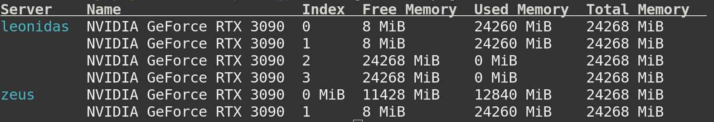

# gpuinfo

A simple CLI for getting information about GPUs from servers listed in SSH config (`.ssh/config`).

**Note**: Currently, only NVIDIA GPUs are supported.

**Example output:**



## Installation

You should have Go installed on your system. If you don't have it, you can install it from [here](https://golang.org/doc/install).

Recommended way of installing `gpuinfo` is to use the official `build` and `install` scripts:

```bash
git clone https://github.com/fkdosilovic/gpuinfo.git
cd gpuinfo
bash ./build.sh
bash ./install.sh
```

## To Do

- [ ] Use different color for free GPUs and GPUs in use
- [ ] Add an option to show only free GPUs
- [ ] Add an option to sort by different criteria
